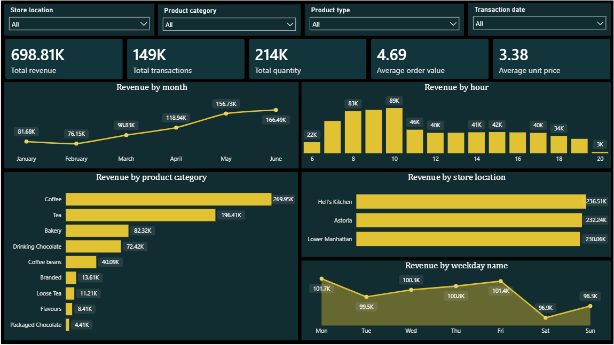

# ☕ Coffee Shop Sales Analysis | Power BI & Excel

## 📌 Project Overview

This project analyzes **coffee shop sales data** to understand revenue performance, product performance, store performance, and sales trends across different time periods.

The project includes **three interactive Power BI dashboards** and **one Excel dashboard**, providing multiple perspectives of the same sales dataset.

The analysis focuses on identifying important business trends such as top-performing products, highest-revenue categories, peak sales hours, store performance, and weekday sales patterns.

---

## 🖼️ Dashboard Preview

### 1. Executive Sales Overview

An executive-level overview of overall sales performance, including revenue trends, hourly sales, product category performance, store performance, and weekday sales.

---

### 2. Product Analysis

Analyzes product and category performance using revenue, quantity, transactions, product types, and top-performing products.

---

### 3. Time & Store Analysis

Analyzes sales performance across different stores, months, hours, and weekdays to identify high-performing locations and peak sales periods.

---

### 4. Coffee Shop Sales — Excel

An Excel-based dashboard presenting key sales KPIs and visual analysis of the coffee shop dataset.

---

## 🛠️ Tools & Technologies

* **Microsoft Power BI**

  * Data Visualization
  * DAX
  * Interactive Slicers
  * KPI Cards
  * Conditional Formatting
  * Data Modeling
* **Microsoft Excel**

  * Data Analysis
  * Pivot Tables
  * Charts & Dashboards
* **Dataset:** Maven Analytics Coffee Shop Sales

---

## 📊 Dashboards Included

### 1. Executive Sales Overview — Power BI

Provides a high-level overview of overall coffee shop sales performance.

**Key metrics:**

* Total Revenue
* Total Transactions
* Total Quantity Sold
* Average Transaction Value
* Average Unit Price

**Key analysis:**

* Revenue by Month
* Revenue by Hour
* Revenue by Product Category
* Revenue by Store Location
* Revenue by Weekday

This dashboard is designed to provide a quick executive-level view of sales performance and major revenue drivers.

---

### 2. Product Analysis — Power BI

Focuses on understanding product and category performance.

**Key analysis:**

* Top 10 Products by Revenue
* Top 10 Products by Quantity
* Revenue by Product Type
* Quantity by Product Category
* Product Category Performance
* Revenue, Quantity, Transactions and Average Unit Price by Category

This dashboard helps identify the products and categories that contribute most significantly to overall sales.

---

### 3. Time & Store Analysis — Power BI

Analyzes sales performance across different stores and time periods.

**Key analysis:**

* Revenue by Month and Store Location
* Revenue by Store Location
* Transactions by Store Location
* Revenue by Hour
* Revenue by Weekday
* Store × Weekday Revenue Analysis

This dashboard helps identify high-performing stores, peak operating hours, and differences in sales patterns across locations and days.

---

### 4. Coffee Shop Sales — Excel

An Excel-based version of the coffee shop sales analysis.

The dashboard uses Excel's data analysis and visualization capabilities to present important sales KPIs and trends in an interactive format.

It provides a comparison between **Excel-based dashboard development and Power BI-based business intelligence reporting**.

---

## 📈 Key Business Questions

The project was designed to answer questions such as:

* How much revenue is being generated?
* How are sales changing over time?
* Which product categories generate the most revenue?
* Which individual products are the top performers?
* Which store location generates the highest revenue?
* What are the busiest sales hours?
* Which days of the week generate the most revenue?
* How does store performance vary across different weekdays?
* Which products have high sales volume versus high revenue?

---

## 🔑 Key Insights

The analysis highlights several important patterns:

* **Coffee** is the highest-revenue product category.
* Sales are strongest during the **morning hours**, with the peak around **10 AM**.
* **Hell's Kitchen** is the highest-revenue store among the three locations.
* Weekday sales are generally stronger than weekend sales.
* A small group of products contributes a significant portion of overall revenue.
* Product quantity and revenue do not always rank products in the same order, highlighting the importance of analyzing both metrics.

---

## 📂 Dataset Columns

| Column             | Description                   |
| ------------------ | ----------------------------- |
| `transaction_id`   | Unique transaction identifier |
| `transaction_date` | Date of transaction           |
| `transaction_time` | Time of transaction           |
| `transaction_qty`  | Quantity purchased            |
| `store_id`         | Store identifier              |
| `store_location`   | Store location                |
| `product_id`       | Product identifier            |
| `unit_price`       | Price per unit                |
| `product_category` | Product category              |
| `product_type`     | Product type                  |
| `product_detail`   | Detailed product name         |
| `revenue`          | Revenue generated             |
| `month`            | Month number                  |
| `month_name`       | Month name                    |
| `weekday`          | Weekday number                |
| `weekday name`     | Weekday name                  |
| `hour`             | Transaction hour              |

---

## 📐 Key DAX Measures

The Power BI dashboards use measures such as:

* Total Revenue
* Total Transactions
* Total Quantity
* Average Transaction Value
* Average Unit Price
* Total Product Types
* Revenue per Quantity

These measures allow the dashboards to dynamically respond to filters and slicers.

---

## 🎯 Skills Demonstrated

### Power BI

* Dashboard Development
* Data Visualization
* DAX Measures
* KPI Design
* Interactive Filtering
* Conditional Formatting
* Business Analysis

### Excel

* Dashboard Development
* Pivot Tables
* Data Visualization
* KPI Reporting
* Sales Analysis

### Data Analytics

* Trend Analysis
* Product Performance Analysis
* Store Performance Analysis
* Time-Based Analysis
* Business Insight Generation

## 🚀 Project Objective

The primary objective of this project was to transform raw coffee shop transaction data into **interactive, business-focused dashboards** that make sales performance easier to understand and support data-driven decision-making.

By developing the project in both **Power BI and Excel**, the project demonstrates the ability to communicate the same business problem through different data analytics and visualization tools.

---

## 👤 Author

**Aviral Kumar**

BCA Student | Aspiring Data Analyst

**Skills:** Power BI • Excel • SQL • Data Analytics
